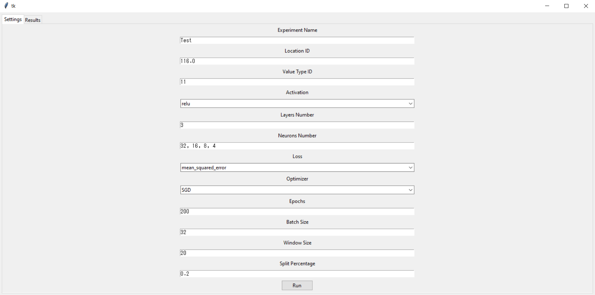
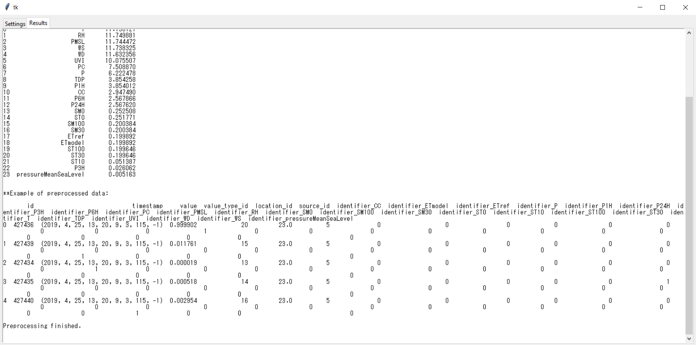

# prediction_with_nn_for_weather_data
Prediction with a NN for weather data

# Report 
Read the file in [report/report.pdf](report/report.pdf)

# Requirements 
This code was tested with PyCharm using Python 3.9 and Tensorflow 2.8.3.

# Preparation
(If .exe file is missing) Prepare the .exe file by running 

$ pyinstaller --onefile -w 'app.py'  

in the terminal. 

Alternatively, message me.

# Run
Open up the application at dist/app.exe, select the options and click run. Figures are saved in dist/report/images. You can update other settings in config.ini. 

# Example 

